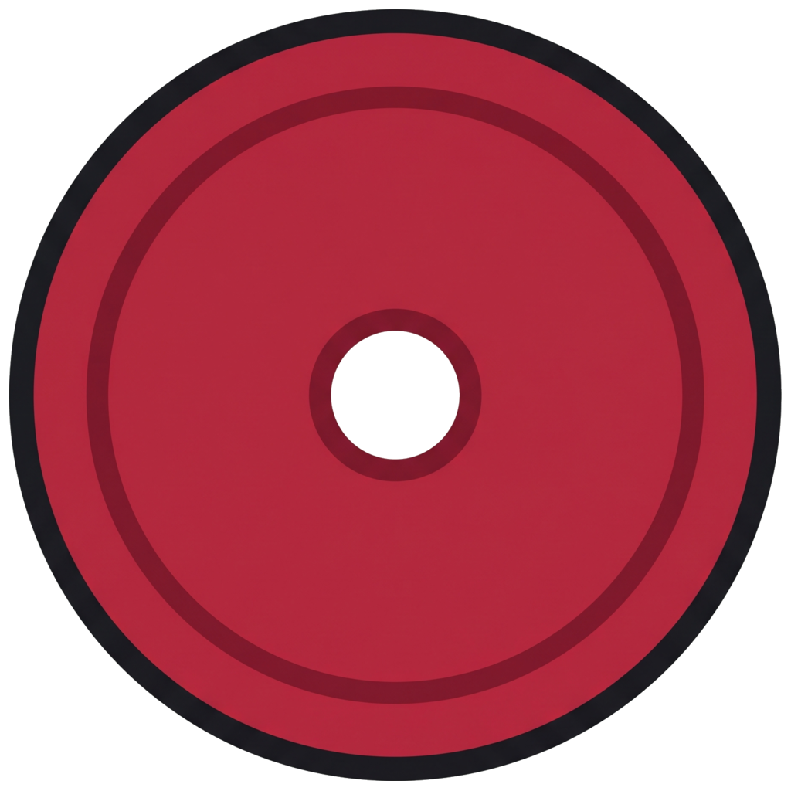
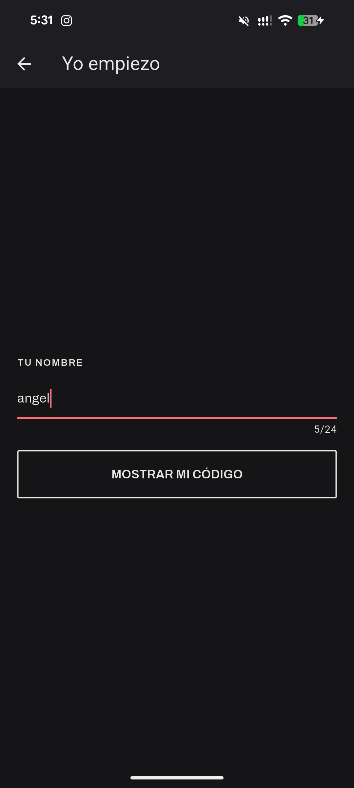
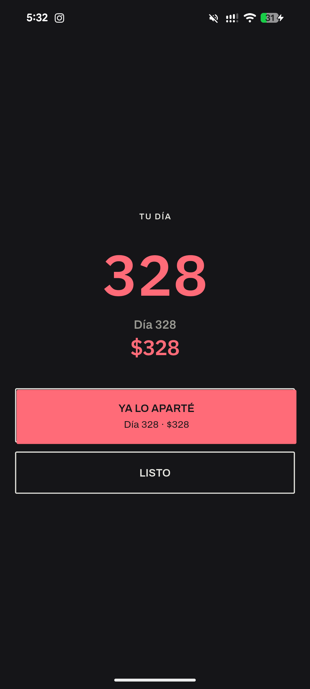
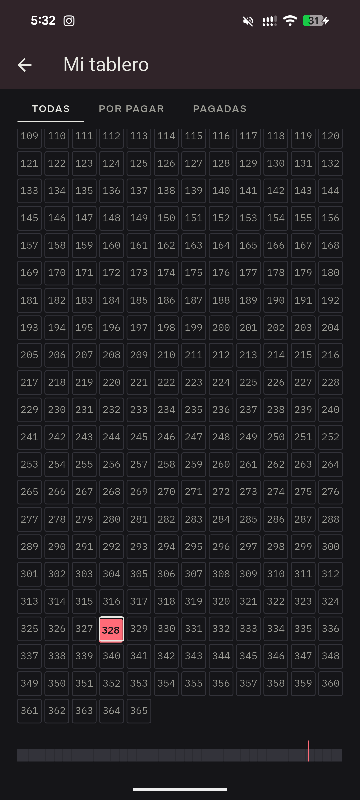

<div align="center">
  
  <h1>Mori · Reto 365 para dos</h1>
  <p>Una app de ahorro <strong>offline, sin backend</strong>, para que dos personas lleven juntas el reto de los 365 días.</p>
</div>

---

Cada persona tiene **su propio tablero de 365 casillas**. El número de la casilla
es el monto en pesos: la casilla 45 son \$45 MXN. Completar las 365 = **\$66,795
MXN por persona**.

Cada día se **sortea** una casilla libre al azar (nunca dos montos caros
seguidos). La app no mueve dinero: solo lleva el registro. La única forma de ver
el avance de tu pareja es **mostrar y escanear un código QR** — sin servidor, sin
cuenta, sin internet.

## Pantallas

| Onboarding | Emparejar (QR) | Inicio | Sorteo | Tablero |
|---|---|---|---|---|
|  |  |  |  |  |


## Stack

| Área | Herramienta |
|---|---|
| Arquitectura | Clean Architecture (Core · Domain · Data · Presentation) |
| Estado + DI | Riverpod 3 (`riverpod_annotation` + `riverpod_generator`) |
| Rutas | `go_router` (expuesto como provider) |
| BD local | Drift + SQLite |
| QR | `mobile_scanner` (leer) · `qr_flutter` (dibujar) |
| Cámara / pantalla | `screen_brightness` (brillo al mostrar un QR) |
| Crash reporting | `sentry_flutter` (opt-in) |
| Plataforma | Android |

## Estructura

```
lib/
├── main.dart                 # opt-in de telemetría → ProviderScope → MaterialApp.router
├── core/                     # transversal, sin dominio propio
│   ├── database/             # AppDatabase (registra las tablas de cada feature)
│   ├── error/                # sealed Failure / Exception
│   ├── router/               # goRouterProvider + enum AppRoute + redirect por estado de pairing
│   ├── telemetry/            # TelemetryConsent + pantalla de opt-in
│   ├── theme/                # InkColors (ThemeExtension), tipografía «Dos tintas»
│   ├── time/                 # Clock inyectable + toEpochDay
│   └── widgets/              # InkButton, GhostButton, Amount, Eyebrow, InkBox, RuleOf365…
└── features/
    ├── pairing/              # crear / unirse / recuperar el reto; ceremonia de dos pasos
    ├── challenge/            # tablero, sorteo, pagos, ceremonia de sorteo
    └── sync/                 # códec del QR, merge de snapshots, panel de la pareja, la pátina
```

Cada feature tiene sus cuatro capas dentro (`domain/ data/ presentation/`).
**Domain** es Dart puro (no conoce Flutter, Drift ni Riverpod); el cableado de DI
vive en `presentation/providers/` para mantenerlo así.

```
Presentation ──▶ Domain ◀── Data
      │             ▲          │
      └──────▶ Core ◀──────────┘
```

## Arrancar

```bash
flutter pub get
dart run build_runner build          # genera *.g.dart (Riverpod, Drift); usa `watch` en desarrollo
flutter run -d <device_id>           # ver dispositivos con: flutter devices
```

Requiere un dispositivo o emulador Android. Permiso: solo `CAMERA`, se pide al
entrar a escanear.

[`assets/icon/README.md`](assets/icon/README.md).
