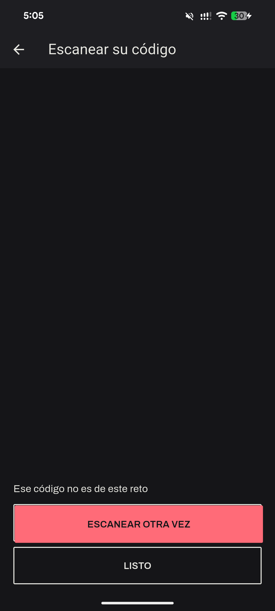
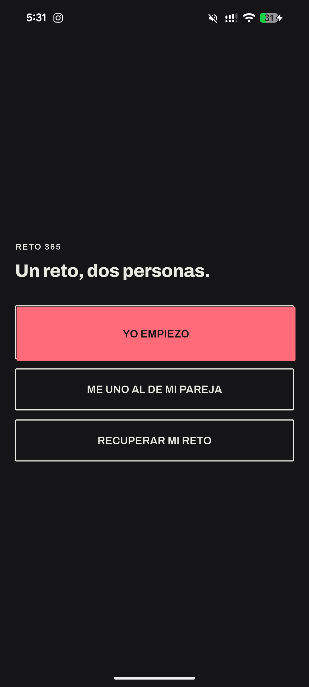
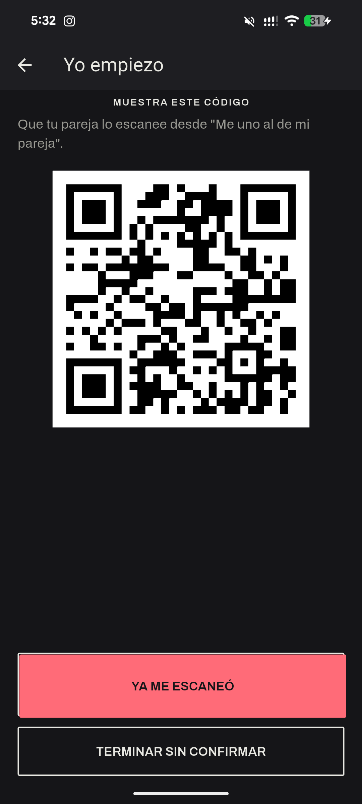
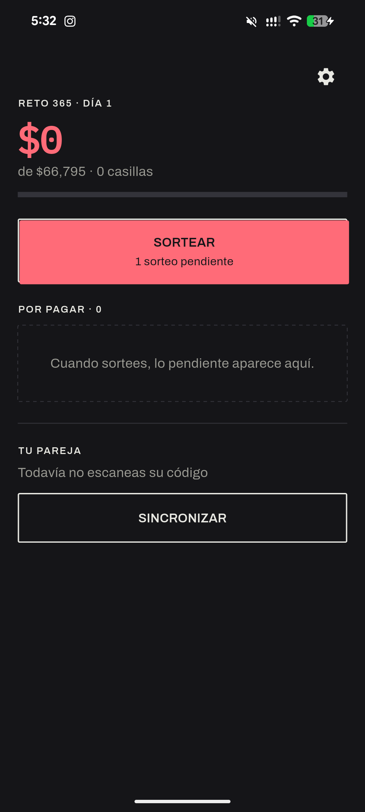

# Flutter Clean Architecture Template

Base reutilizable para nuevos proyectos Flutter. Sin lógica de negocio: solo el
esqueleto arquitectónico y las herramientas configuradas.

**Stack**

| Área            | Herramienta                                        |
| --------------- | -------------------------------------------------- |
| Arquitectura    | Clean Architecture (Core · Domain · Data · Presentation) |
| Estado + DI     | Riverpod 3 (`riverpod_annotation` + `riverpod_generator`) |
| Enrutamiento    | GoRouter (expuesto como provider)                  |
| BD local        | Drift + SQLite (`drift_flutter`)                   |
| Codegen         | `build_runner`                                     |

---

## 1. Estructura de carpetas

```
lib/
├── main.dart                     # runApp(ProviderScope(...)) + MaterialApp.router
│
├── core/                         # Transversal. NO depende de features (salvo app_database).
│   ├── database/
│   │   ├── app_database.dart      # @DriftDatabase: registra TODAS las tablas de features
│   │   └── database_providers.dart# appDatabaseProvider (keepAlive)
│   ├── error/
│   │   ├── failures.dart          # sealed Failure — cruza fronteras de capa
│   │   └── exceptions.dart        # Exception crudas, viven dentro de Data
│   ├── router/
│   │   └── app_router.dart        # goRouterProvider + enum AppRoute
│   ├── theme/
│   │   └── app_theme.dart         # ThemeData claro/oscuro
│   ├── usecase/
│   │   └── usecase.dart           # abstract UseCase<T, Params> + NoParams
│   └── utils/
│       └── result.dart            # sealed Result<T> = Ok | Err  (Either sin dependencias)
│
└── features/
    └── counter/                   # Un feature = un vertical con sus 4 capas dentro
        │
        ├── domain/                # PURO. Cero imports de Flutter / Riverpod / Data.
        │   ├── entities/
        │   │   └── counter.dart           # objeto de negocio
        │   ├── repositories/
        │   │   └── counter_repository.dart # contrato abstracto (lo posee Domain)
        │   └── usecases/
        │       ├── get_counter.dart        # 1 caso de uso = 1 clase con call()
        │       └── increment_counter.dart
        │
        ├── data/                  # Implementa los contratos de Domain.
        │   ├── tables/
        │   │   └── counter_table.dart      # definición de tabla Drift
        │   ├── models/
        │   │   └── counter_model.dart      # mapea fila Drift  <->  entidad Domain
        │   ├── datasources/
        │   │   └── counter_local_data_source.dart # habla con AppDatabase; lanza CacheException
        │   └── repositories/
        │       └── counter_repository_impl.dart   # traduce Exception -> Failure (Result)
        │
        └── presentation/          # Flutter + Riverpod. Sin lógica de negocio.
            ├── providers/
            │   └── counter_notifier.dart   # DI de casos de uso + Notifier (AsyncNotifier)
            └── screens/
                └── counter_screen.dart     # ConsumerWidget
```

### Qué va en cada capa

- **Core** — código sin dominio propio, compartido por todos los features: tipos
  de error, base de datos, router, tema, contratos base, utilidades. La única
  concesión: `app_database.dart` importa las `tables/` de cada feature porque
  Drift necesita conocerlas en un solo lugar.
- **Domain** — el corazón. Entidades, contratos de repositorio y casos de uso.
  100 % Dart puro y testeable sin Flutter. No conoce Drift, JSON ni Riverpod.
- **Data** — implementa lo que Domain declara. Tablas/DTOs (`model`),
  `datasources` (fuente concreta: Drift, HTTP…) y `repositories` que capturan
  `Exception` y devuelven `Result<Ok|Err>`.
- **Presentation** — UI y estado. `Notifier`/`AsyncNotifier` de Riverpod,
  pantallas y widgets. Llama a casos de uso, nunca a repositorios ni datasources
  directamente.

### Regla de dependencias

```
Presentation ──▶ Domain ◀── Data
      │             ▲          │
      └──────▶ Core ◀──────────┘
```

Domain no apunta a nadie. El cableado de DI de los casos de uso vive en
Presentation (`counter_notifier.dart`) para mantener Domain puro.

---

## 2. Core & Router

### `lib/main.dart`

```dart
void main() {
  // ProviderScope = contenedor Riverpod raíz = raíz de la inyección de dependencias.
  runApp(const ProviderScope(child: MoriApp()));
}

class MoriApp extends ConsumerWidget {
  const MoriApp({super.key});

  @override
  Widget build(BuildContext context, WidgetRef ref) {
    final router = ref.watch(goRouterProvider);
    return MaterialApp.router(
      theme: AppTheme.light,
      darkTheme: AppTheme.dark,
      routerConfig: router,
    );
  }
}
```

### `lib/core/router/app_router.dart`

```dart
enum AppRoute { home }

@Riverpod(keepAlive: true)
GoRouter goRouter(Ref ref) {
  return GoRouter(
    initialLocation: '/',
    routes: [
      GoRoute(
        path: '/',
        name: AppRoute.home.name,
        builder: (context, state) => const CounterScreen(),
      ),
    ],
  );
}
```

El router es un provider: puede reaccionar a otros providers (auth, flags) con
`ref.watch` y `refreshListenable`.

---

## 3. Flujo end-to-end (contador persistido)

`CounterScreen` → `counterProvider` (Notifier) → `GetCounter` / `IncrementCounter`
(Domain) → `CounterRepository` → `CounterRepositoryImpl` (Data) →
`CounterLocalDataSource` → **Drift / SQLite**.

- **Domain**: `Counter` (entidad), `CounterRepository` (contrato),
  `GetCounter` / `IncrementCounter` (casos de uso `UseCase<Counter, NoParams>`).
- **Data**: `CounterEntries` (tabla Drift, fila única `id == 1`),
  `CounterModel` (mapper fila↔entidad), `CounterLocalDataSourceImpl`
  (`select` / `insertReturning` / `writeReturning`), `CounterRepositoryImpl`
  (`Exception` → `Failure`, envuelto en `Result`).
- **Presentation**: `CounterNotifier extends _$CounterNotifier` con
  `Future<int> build()` (carga el valor guardado) e `increment()`
  (`AsyncValue.guard`). `CounterScreen` es un `ConsumerWidget` que hace
  `switch` sobre el `AsyncValue`.

> ⚠️ `riverpod_generator` v3 recorta el sufijo `Notifier`: la clase
> `CounterNotifier` genera el provider **`counterProvider`**.

---

## 4. Codegen

```bash
flutter pub get
dart run build_runner build          # una vez
dart run build_runner watch          # en desarrollo
```

Genera: `*.g.dart` de Riverpod (providers), de Drift (`AppDatabase`, filas,
companions).

---

## 5. Ejecutar en un emulador Android

Este proyecto tiene configurada la plataforma **Android**. Para ejecutarlo en un
emulador:

```bash
# 1. Lista los emuladores disponibles
flutter emulators

# 2. Arranca uno por su id (ej: Pixel_8a)
flutter emulators --launch Pixel_8a

# 3. Con el emulador ya abierto, verifica que Flutter lo detecta
flutter devices

# 4. Ejecuta la app
flutter run
```

Si `flutter run` detecta varios dispositivos, selecciona el emulador con
`-d <device_id>` (el id que aparece en `flutter devices`), por ejemplo:

```bash
flutter run -d emulator-5554
```

> Requisitos previos: haber corrido `flutter pub get` y el codegen
> (`dart run build_runner build`) de la sección 4. Si no tienes ningún emulador,
> créalo con `flutter emulators --create` o desde Android Studio (Device Manager).

---

## 6. Renombrar el proyecto al clonar

```bash
./rename_project.sh <nuevo_nombre> [dominio_android]

# ejemplos
./rename_project.sh awesome_app
./rename_project.sh awesome_app com.acme
```

El script:

1. Reemplaza `mori` → `<nuevo_nombre>` (word-boundary) en `lib/`, `test/`,
   `pubspec.yaml`, `README.md` — imports `package:...` y clave `name:`.
2. Reemplaza `com.example.mori` → `<dominio>.<nuevo_nombre>` en `android/`
   (namespace, applicationId, package Kotlin).
3. Borra los `*.g.dart`, corre `flutter pub get` y `build_runner`.

Requiere `perl` (presente en Linux y macOS). Tras ejecutarlo: revisa
`git diff`, renombra la carpeta del repo y `flutter run`.

Alternativa con paquete dedicado:

```bash
dart pub global activate rename
rename setAppName --value "Awesome App"
rename setBundleId --value "com.acme.awesome_app"
```

---

## Añadir un feature nuevo

1. `lib/features/<feature>/{domain,data,presentation}/` replicando `counter/`.
2. Si usa BD: crea la tabla en `data/tables/`, regístrala en
   `core/database/app_database.dart` (`@DriftDatabase(tables: [...])`) y sube
   `schemaVersion` + migración.
3. Añade la ruta en `core/router/app_router.dart` (`AppRoute` + `GoRoute`).
4. `dart run build_runner build`.

---

## Capturas








